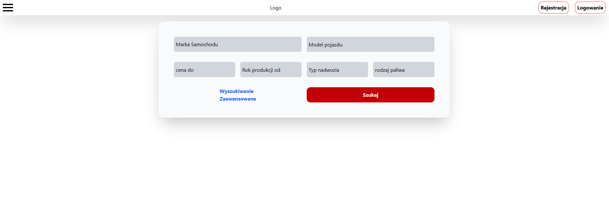
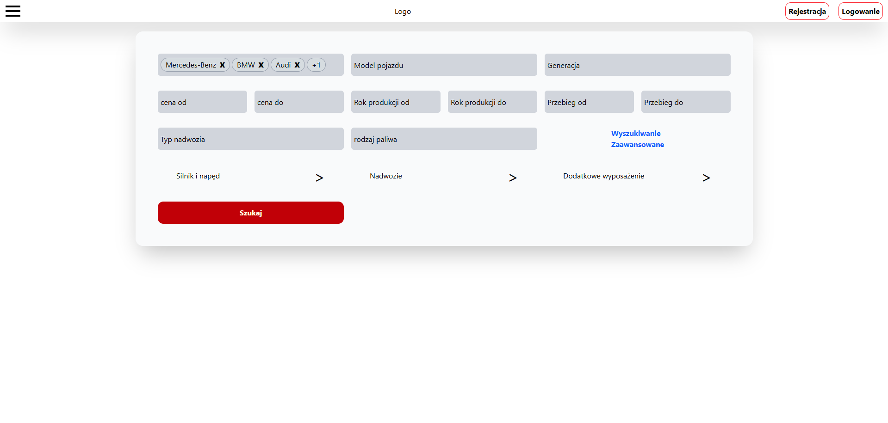
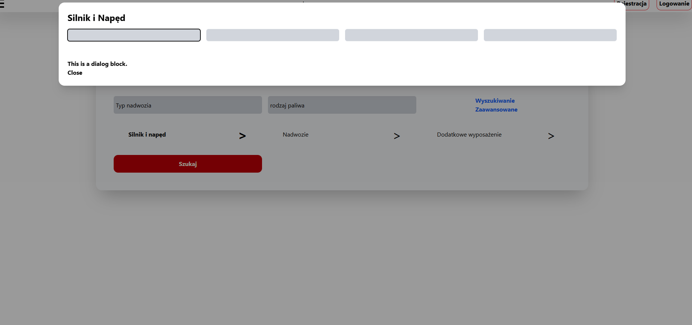
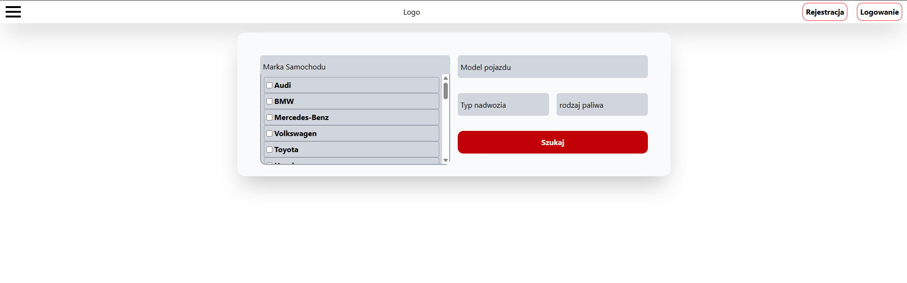

# 🚗 CarSearching

Blok wyszukiwania samochodów w formie nowoczesnego komponentu front-endowego.  
Zaprojektowany z myślą o estetyce, intuicyjności i animacjach – bez implementacji backendu.

---

## 🛠️ Technologie


---

## 🎯 Demo

🔗 **Sprawdź online:** [link-do-demo](#)

---

## 📸 Screeny

| Widok prosty                   |              |
| ------------------------------ | ------------------------------------------ |
| Widok zaawansowany             |            |
| Modal                          |              |
| ------------------------------ | ------------------------------------------ |
| Wybór marki                    |  |

---

## ✨ Kluczowe cechy

- 🔁 Tryb prosty i zaawansowany do wyszukiwania aut
- 💡 Responsywny i przejrzysty layout
- ✅ Komponenty dynamiczne z obsługą selekcji i list rozwijanych
- 🧩 Dialogi modalne z dodatkowymi parametrami wyszukiwania
- 🎬 Animacje `framer-motion` przy renderowaniu elementów

---

## 🔍 Przykładowy kod – komponent `DivSearch`

```jsx
<motion.div
  ref={wrapperRef}
  layout
  layoutId={insideText}
  initial={isNew ? { scale: 0, opacity: 0 } : false}
  animate={isNew ? { scale: 1, opacity: 1 } : false}
  exit={isNew ? { scale: 0 } : false}
  className={`col-span-${size} bg-gray-300 rounded-[6px] w-full h-full ease-in-out relative`}
>
  {/* Zawartość dynamiczna */}
</motion.div>
```

---

## 📦 Instalacja

1. Sklonuj repozytorium:
   ```bash
   git clone https://github.com/twoj-login/carsearching.git
   cd carsearching
   ```
2. Zainstaluj zależności:
   ```bash
   npm install
   ```
3. Uruchom projekt lokalnie:
   ```bash
   npm run dev
   ```

---

## 🧾 Licencja

Projekt open-source. Możesz go modyfikować i rozwijać zgodnie z własnymi potrzebami.  
[MIT License](LICENSE)
